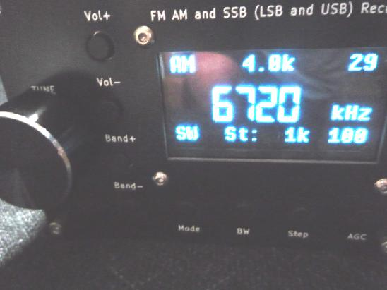
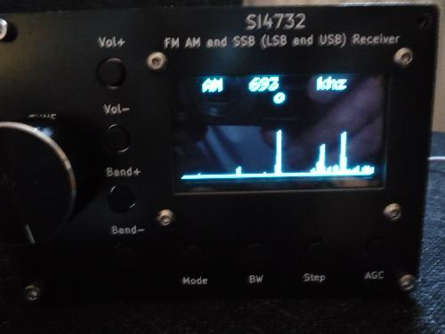
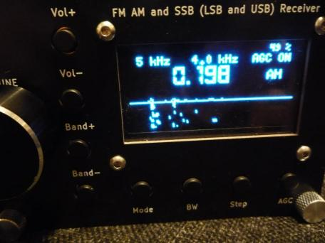
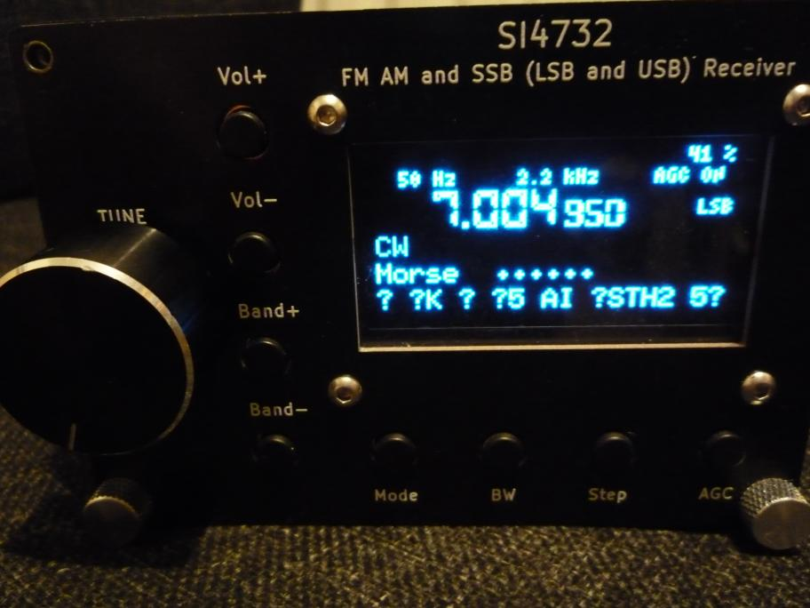
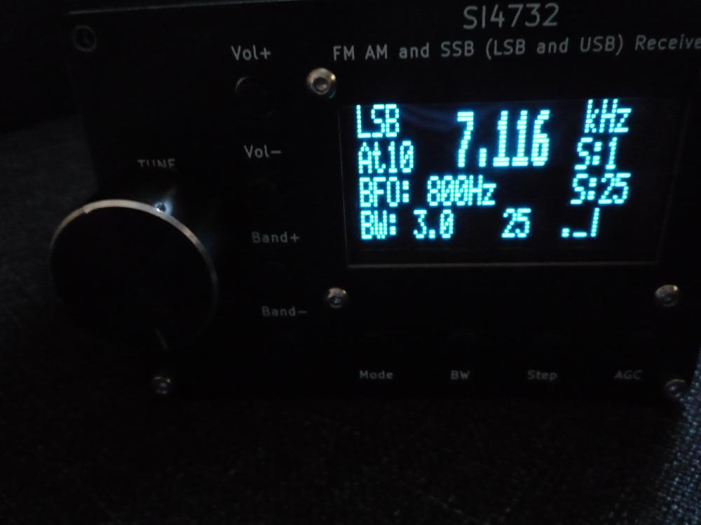
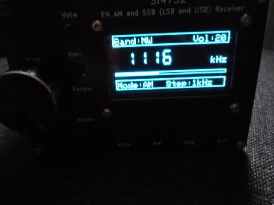
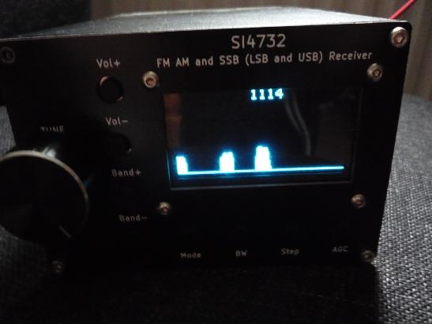
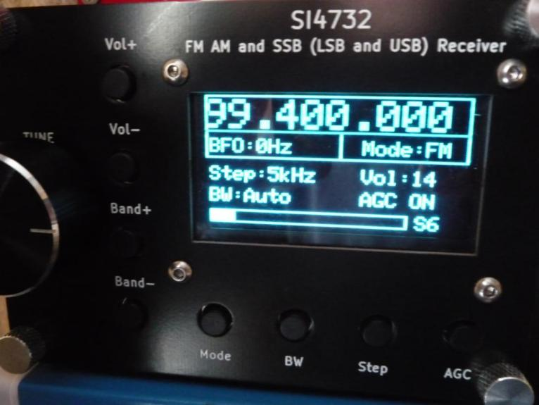

# Receiver with a big 2.42 oled screen using Si4732 and ESP32 S2 Mini.

This folder contains popular firmware sources converted to work with this hardware
project and precompiled bin files in case of future problems with compiling on Arduino IDE.

# goshante ESP32_ATS_EX with Bandscan (long press Mode)
Support for SI5351 or Crystal press mode button on startup to select which.

    

Hold Mode button to activate Bandscan then navigate to adjacent signals using BW, Step buttons and Encoder then select the station.

    

# joaquim si4732-radio

    

    

# pu2clr ESP32_OLED_CHINESE

    

# CT2JWF ESP32_SI473X_ALL_IN_ONE_OLED_CT2JWF_EEPROM_RDS_v8.0.1)
#
#

# ESP 32 Minimini with Bandscan

    

    

# LZ1PPL

    

