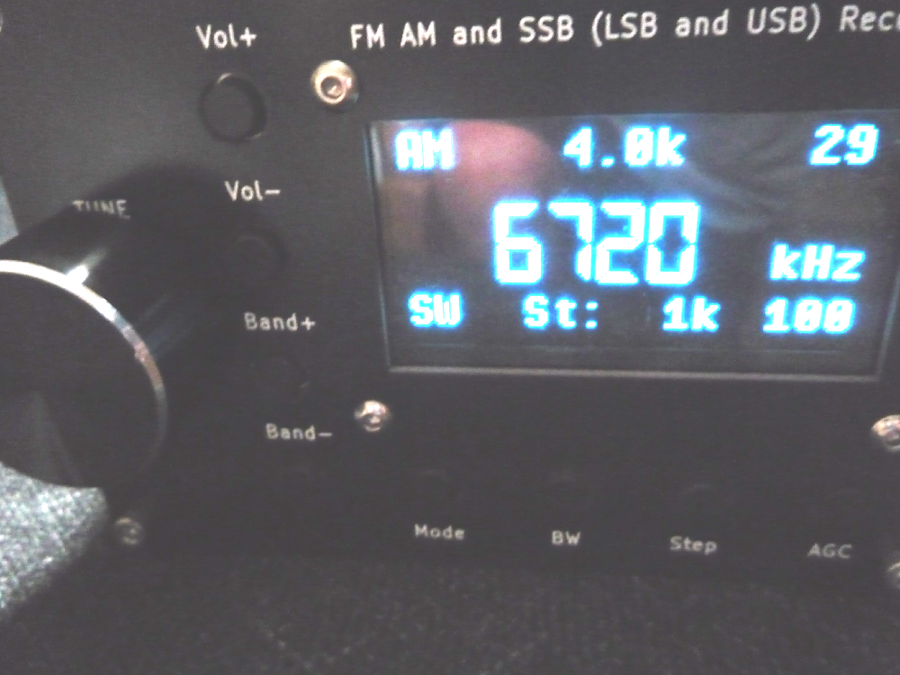

# Receiver with a big 2.42 oled screen using Si4732 and ESP32 S2 Mini.

This folder contains popular firmware sources converted to work with this hardware
project and precomplied bin files in case of future problems with compliing on Arduino IDE.

# pu2clr, LZ1PPL and goshante

https://github.com/pu2clr/SI4735

https://github.com/LZ1PPL/Si4735

https://github.com/goshante/ats20_ats_ex

    

