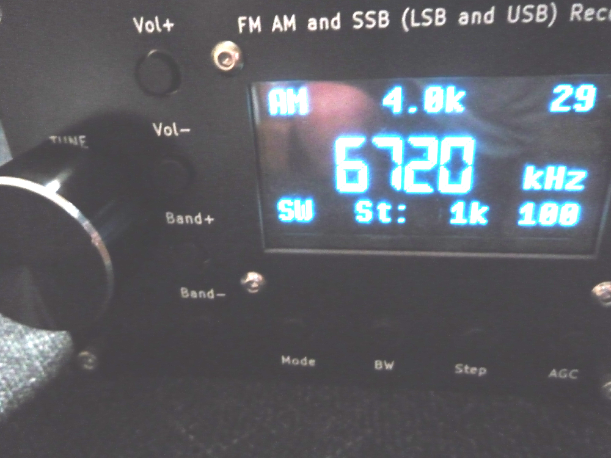
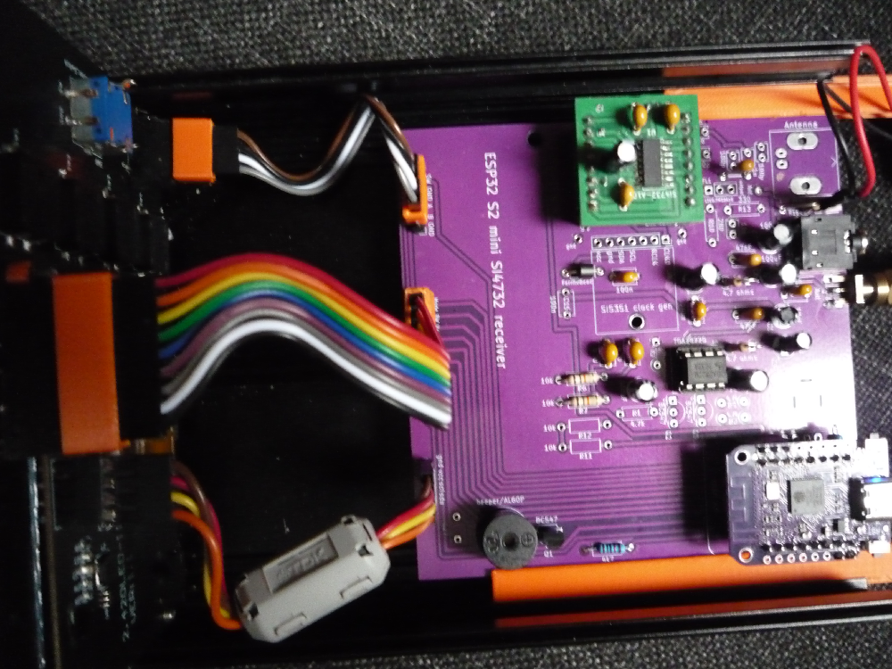
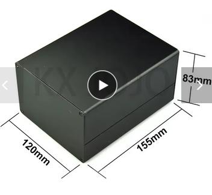

# Receiver with a big 2.42 oled screen using Si4732 and ESP32 S2 Mini.

Based on the works of 
# pu2clr, LZ1PPL and goshante

https://github.com/pu2clr/SI4735

https://github.com/LZ1PPL/Si4735

https://github.com/goshante/ats20_ats_ex

    

    

Using this Aliexpress box

    

    

